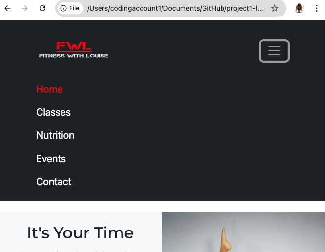
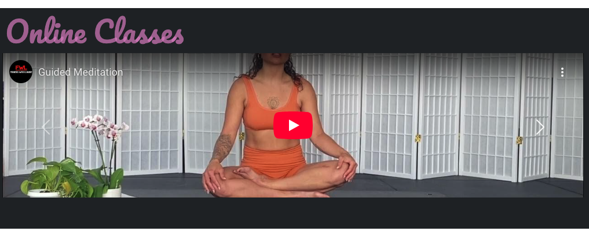
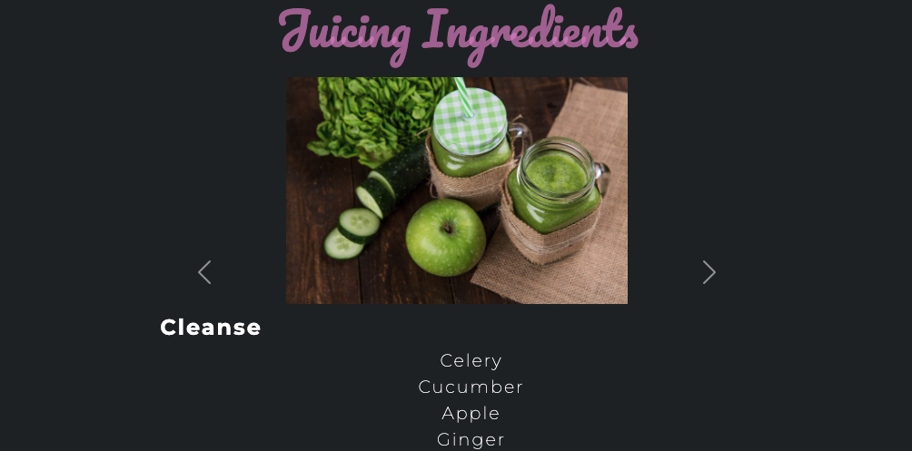

 
# FWL online fitness classes and nutritional advice
## About
FWL (Fitness with Louise) is a company offering free online fitness classes and nutritional advice via their newly built website. Theyr'e targeting  those who want to improve their health and wellbeing and build their inner confidence, as they strogly belive they have the right coaches who can deliver high energy and top quality online classes. Besides free classes, FWL provide other services such as online 1-to-1 personal training sessions and health and fitness events, both in the UK and abroad.
The FWL website offers a clean and simple astheitc, using the FWL company colours as a base for the colour scheme. Visitors to the site can expect a great user experience as they can easily navigate their way through the website using links (internal and external), animated buttons and social icons, and carousels and dropdown menus. 

### How to run the project
To access free content hosted on the FWL website simply click the link below or copy and past it into your broswer.

[View Live Site.](https://louiseskinner01.github.io/project1-lskinner/) Hosted on GitHub Pages.
## Key Features
- **Home page:** Presents the user with motivational and encouraging content, it also presents a range of Bootstrap cards that host the FWL fitness events. Users can register for the event by clicking on the register button,linking them through to the contact form where they will enter their personal information.
- **Classes page:** Presents the user with a carousel of fitness videos. The user can also choose from a range a fitness programs and utilise the tips and techniques listed.
- **Contact page:** Presents the user with a booking form that ensures the users input is validated before it can be submitted (ficticiusly), using the submit button.
- **Nutrition page:** Offers the user nutriional advice and a carousel of Juice ingredients.
- **404 Error page:** FWL have apersonalised 404 error page, this will be deployed if there is an error loading a page. The 404 error page has a button that the user can click to take them back to the home page.
## UX Design
### Strategy
**Purpose**
- Encourage users to book a personal training session by showcasing their  free online classes and training programs.
- Provide a seamless user experience to keep users engaged in physical activity and educated on nutrition, health and wellness.

**Primary User Needs**
- Learn about the companies purpose, service offering and events.
- Join the a community of like minded people and keep up to date with latest health and fitness trends.
- Access responsive, user-friendly content.

**Business Goals**
- Increase online presence.
- Boost participation in events and social media engagement.
### Scope
**Content Requirements**
- Clear, motivational text about the companies mission.
- Classes to showcase the instrutors and their teaching styles.
- Event schedules, descriptions and registration buttons.
- Contact form for users to book pt sessions, register for events, enquire about careers or for anything else.
### Structure
**Information Architecture**
- **Navigation Menu**:
  - Accessible links in the navbar.
- **Hierarchy**:
  - Prominent placement of social media links in the footer.

**User Flow**
1. User lands on the home page → learns about the companies mission.
2. Navigates to events → views the events → checks upcoming event details → registers for chosen event.
3. Navigates to the classes page → the user views free online classes → access to free training programs and exercise tips.
4. Navigates to the nutrition page → learns about macro and micro nutrients → views juiuces and ingredients lists via a carousel.
5. Makes an enquiry by the contact page → clicks the submit button → user lands on the confirmation page.

### Skeleton
#### Wireframes
##### Mobile

**Home page**
  
- **Classes page**
  
- **Nutrition page**
  
- **Contact page** 
  
- **Confirmation page**
  
- **404 Error page**
 

 ##### Tablet
- **Home page**

- **Classes page**

- **Nutrition page**

- **Contact page**

- **404 Error page**

- **Confirmation page**

##### Laptop
- **Home page**

- **Classes page**

- **Nutrition page**

- **Contact page**

- **404 Error page**

- **Confirmation page**

### Surface
#### Colour-scheme
To make the brand stand out I used the branding colours as the base colour theme for the design, this was a simple red, black and white. To make the design pop I added two additonal greens and a pink that would be assigned to a specific typography.  

- **Primary colour – Red:** This acts as an active colour and also acts as a highlight colour for the footbar icons.
- **Secondary colour - Dusky Pink rgba(221, 137, 203, 0.681):** This is used on conjunction with the variable "Header font" (Pacifico). It is used to draw attention to things like events, online classes and juicing ingredients.
- **Highlight colour:** This has been applied to the navigation bar to highlight when the user is hovering over a tab. It has also been used as the base colour for the footerbar prior to them being hovered over.
- Booking-button colour: This colour has been applied to all buttons throughout the website.

- Navigation font: Base = White, Active = --primary-color (red), Highlight = --highlight-color (green).

#### Typography
For the development of this project I have chosen to utilise Google fonts as they provide font styles that meet the design requirements for accessibility and user-experience. I imported the following fonts into my css stylesheet, each font having a a back-up font incase the browser doesn't support the gogole font. 
- "Pacifico",  Cursive;
- "Monserrat", Sans-serif; 
- "Outift", Serif;

- **Monseratte:** Has been assigned as primary font which is the main font for the body.
- **Pacifico:** Has been used for special headings to draw attention to partocular peices of content.
- **Outfit:** Has been assigned as a secondary font for all other content.

## User-stories

- As a visitor, I want to browse available fitness programs that are free and easily accessible
- As a visitor, I want to easily undestand what services and/or produducts are provided by FWL 
- As a user, I want to be able to book an online personal training session with a PT (e.g. strength, flexibility) so that I can have some guidance along my fitness journy
- As a user, I want access to meal plans and nutritional advice so that I can support my fitness goals with proper diet
- As a visitor, I want to see how the trainers teach so that I can choose a trainer who matches my goals
- As a user, I want access to video demonstrations of exercises so that I can perform them correctly and avoid injury
- As a user, I want to be able to register my details and have a member of FWL reach out to me to discuss their products and services in further detail
- As a user, I would like to find health and wellbeing events 
- As a user, I would like to have access to juicing ideas and ingredients lists
- As a user, I would like to easily find and follow FWL on all of their social media platforms
- As a user, I would like to be kept up to date with the latest health and fitness trends

## Features
### Navigation
The FWL website has a responsive navigation bar that utilises Boostrap 5 components. It has been customised to using the branding colours of FWL (which are Red, Black & White) to ensure the branding logo pops. The navbar has a simplistic approach, leaning into a clean and modernised look. The FWL company logo links to the bookings form where users can fill in their details and select from a list of reasons for contact. The booking form also features a text-box where the user can write additional information to be acompany the form.
Due to the naviation bar being deveoped using a "mobile first" approach, there is a toggle feature when the user is browsing from a mobile devise, this enables the user a better experience as the can easily naviagte through the tabs. The toggle feature can be identified by the "burger-icon" (another bootstrap component) used to enhance the users experience.
Another feature the navigation bar has is the data-bs-theme="dark" to enable a better user experience when browsing in nightmode. 
#### Other navigation features
The navbar also features a hover changing the hobered nav link from it's base colour white to green (highlight color). If the nav link is in an "active" state then the link will remain red (primary colour) and the font weight will become bold when hovered upon.

**Navigation toggle feature mobile-collaspe**
 

**Navigation toggle feature mobile-expand**
 

### Footbar
The footbar is very clean and simple, containing only 1 heading and 3 icons. Each icon has been customised to be slightly larger than their original aspect and a different colour. They are coloured green (highlight colour) and when hovered upon they turn red (primary colour), this highlights the interactiveness the user experiences and brings life to the footbar bar.
 To enhance the users experience I have also applied the targe="_blank" attribute so when the user clicks on the icon they are taken to an external page and won't be lose their current page on the FWL website.

**Footer social icons**

**Footer social icons Hover effect**

### Carousel
FWL wanted to provide free online classes for the website visitors to help promote health and wellbeing and grow a fitness community. To maintain a minimal look across the site I decided to implement a video carousel for website users to easily browse the online classes.
This appaoch is based on utilising iframe tags over video tags because it saves space in the developers assets folder and is faster to load in the browser.

### Dropdowns 
FWL provide free fitness programs and wanted this to be something that looked clean and was a simple procress for the web user. I decided to use a series of dropdown menus, setting the menu-item to an auto hight so content was presented nicely and didn't take up too much space.
The dropdown menus are segregated into 3 blocks, each reflecting a different type of training, these are;
- Strength
- Conditioning
- Stretch & Mobility

Home page

  

## Testing
The FWL website has been put through a serious of vigourus testing methods to ensure that the site is responsive on mobile, tablet, laptop and desktop screens. Methods of testing include utilising the lighthouse feature on Chrome development tools, manual testing all links, buttons and dropdowns features, and validating html and css code through online validation tools. To see the testing process and results in more detail please click the link below.
 [TESTING.md](TESTING.md)

## Technologies
### Languages
- HTML
- CSS
### Frameworks
- **Bootstrap:** I utilised Bootstrap version so I could develop the FWL website to be responsive, accessible and inline with web developement trends. Boostrap offers a range of components to allow for a faster development and a modern result.

### Tools
#### Development Tools

- **GitHub:** I have used Github as it supports version control by tracking all changes made throughout the development of the project. Github provides many features that have helped with the development of the FWL website such as project board that can be utilised as a project management tool allowing developers to create milestones and label them with priority tags. It offers stages of deveopment such as to do, in progress and done (completed).
Github isn't just a configuration management tool it provides a special feature than allows deveopers to deploy their project so they are hosted live. This feature is perfect as developers can share their work with peers and future employers with just one simple link.
- **Visual Studio Code:** I downloaded and installed Visual Studio Code which is an IDE (Intergrated Deveopment Environment), this was for the purpose of coding my HTML and CSS docs. VS Code is very useful for deveopers as it connects directly to my Github repository making commits a simple process.
- **Chrome Developer Tools:** I utilised Chrome deveoper to design the FWL website using amobile first approach. The deveopment tool enabled me to view the web pages using different screen sizes which helped me to make a responsive website. I aso used the tool to inspect elements so I could see what elements were causing unwanted effects across the site.
#### Design & UI
- **Balsamiq Wireframes:** I used this online tool to create wireframes for each page oof the site. A wireframe has also been cteated for mobile, tablet and laptop screen sizes.
- **Google Fonts:** I have imported 3 different Google font styles into my CSS file to style the FWL website, helping to draw attention to specific content areas.
- **Font Awesome:** Provides scalable icons used for social media links and other design elements.
- **Favicon Generator:** I used this online tool to create an icon that can sit in the title tabe of the web pages.

#### Validation testing
**W3C Validator:** I used this online tool to validate my CSS and HTML code. It's a great tool as it higghlighted many issues I had in my code and I was able to make amendments to ensure all my code clean and valid. 
Please see the TESTING document for test results: [TESTING.md](TESTING.md)

#### Other tools utlised

- **Notepad:** I utilised notepad to write my content and program ideas.
- **TinyPNG:** I utilised TinyPNG to make my image sizes smaller as they were too large and causing the FWL webpages to laod at a slow pace, this in turn was causing my Lighthouse testing result to be poor.
- **Favcon Converter:** I used an online converter to make the FWL company logo into a favcon so the logo would be visible in the browser tab.
- **MS Word:** I used Microsoft Word for proof reading written content.
## Deployment
### GitHub Pages

The site was deployed to GitHub Pages. The steps to deploy are as follows:

- In the [GitHub repository](https://www.github.com/Louiseskinner01/project1-lskinner), navigate to the "Settings" tab.
- In Settings, click on the "Pages" link from the menu on the left.
- From the "Build and deployment" section, click the drop-down called "Branch", and select the **main** branch, then click "Save".
- The page will be automatically refreshed with a detailed message display to indicate the successful deployment.
- Allow up to 5 minutes for the site to fully deploy.

The live link can be found on [GitHub Pages](https://louiseskinner01.github.io/project1-lskinner).

### Local Development

This project can be cloned or forked in order to make a local copy on your own system.

#### Cloning

You can clone the repository by following these steps:

1. Go to the [GitHub repository](https://www.github.com/Louiseskinner01/project1-lskinner).
2. Locate and click on the green "Code" button at the very top, above the commits and files.
3. Select whether you prefer to clone using "HTTPS", "SSH", or "GitHub CLI", and click the "copy" button to copy the URL to your clipboard.
4. Open "Git Bash" or "Terminal".
5. Change the current working directory to the location where you want the cloned directory.
6. In your IDE Terminal, type the following command to clone the repository:
	- `git clone https://www.github.com/Louiseskinner01/project1-lskinner.git`
7. Press "Enter" to create your local clone.

Alternatively, if using Gitpod, you can click below to create your own workspace using this repository.

**Please Note**: in order to directly open the project in Gitpod, you should have the browser extension installed. A tutorial on how to do that can be found [here](https://www.gitpod.io/docs/configure/user-settings/browser-extension).

#### Forking

By forking the GitHub Repository, you make a copy of the original repository on our GitHub account to view and/or make changes without affecting the original owner's repository. You can fork this repository by using the following steps:

1. Log in to GitHub and locate the [GitHub Repository](https://www.github.com/Louiseskinner01/project1-lskinner).
2. At the top of the Repository, just below the "Settings" button on the menu, locate and click the "Fork" Button.
3. Once clicked, you should now have a copy of the original repository in your own GitHub account!

## Stretch Goals
### For the site
Responsive Design Enhancements – Optimize the site for tablets and large displays (beyond mobile responsiveness).
Accessibility Improvements – Implement ARIA roles and improve keyboard navigation.
### For the user
- As a visitor, I want to read client testimonials so that I can trust the effectiveness of the fitness plans.
- As a visitor, I want to view trainer profiles so that I can choose a trainer who matches my goals.
- As a visitor, I want to create an account or log in so that I can access personalized features.
- As a user, I want to log workouts and body stats so that I can track my progress over time
- As a user, I want email or app reminders for my workouts so that I stay consistent with my routine.
- As a user, I need the option to pay for products/services using methods such as debit/credit, klarna, or paypal.

## Future Enhancements 
FWL wanted a simple, static website so they could share their content to the health and fitness community, and by doing so they hope to grow their online presence across all platforms (internet and social).
Beyond this FWL would like to further expand their portfolio by offering more services and products such as branded merchandise and fitness equipment, and they would also like for their clients to be able to purchase their services and products online. This means FWL would require a dynamic website that can support payment transactions and online booking/scheduling. 

FWL would like their future website to allow users to do the following;

- Create, update and delete a user account
- Purchase services and products using various payment methods such as credit,debit,payapl, and klarna
- Be able to see live updates (real time) on what merchandise and events are available (in stock) to purchase
- Book sessions online using a real-time calendar showing the availbility of FWL and the fitness team
- Log into an online portal where the user will have a live online personal training session
- Track progress, body stats and upload befor and after pictures
- Receive email/text reminders (depeding on the users preference) 

## Credits/Referencing

- **ChatGBT:** Stretch Goals - User stories and some of the Main User Stories
 - **Unsplash** I used this online tool for free images of juices for the juice ingredients carousel on the Nutrition page

 | Source | Notes |
| --- | --- |
| [favicon.io](https://favicon.io) | Generating the favicon |
| [Boostrap](https://getbootstrap.com/) | Auto generated components|
| [TinyPNG](https://tinypng.com) | Compressing images < 5MB |
| [CompressPNG](https://compresspng.com) | Compressing images > 5MB |

