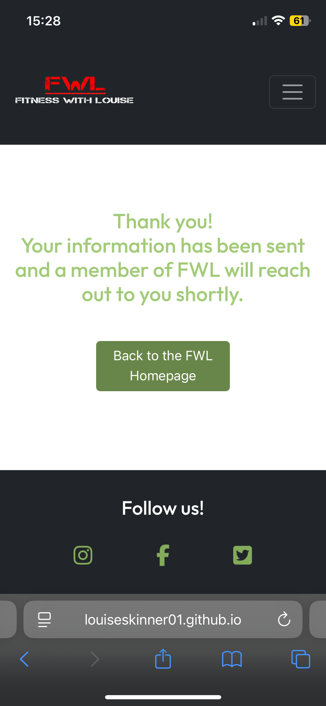

# Testing methods and results
## Manual Testing
### User Stories
  
| **User Story**                | **Has the objective been met? (Y/N)**              | **How has the objective been met?** |
| --------------------------------------------------------------------------- | ----------------------------------------------------------------------------------------------------------------------- | ---------- |
| As a visitor, I want to browse available fitness programs that are free and easily accessible   | Y | The FWL website offers a range of fitness programs that are easily accessible to the user by the implementation of the Bootstrap Dropdown menu component. The programs are split into 3 training areas, each offering 4 different training programs to the user.  |
| As a visitor, I want to easily undestand what services and/or produducts are provided by FWL    |   Y  | The FWL home page presents the user with a clear and consice message about what services/products they offer, who their target audience is, and how they can help their tagert audience to get fitter, healther and more confident.   |
| As a user, I want to be able to book an online personal training session so that I can have some guidance along my fitness journy   |  Y   | The FWL website provides a contact form where the user can fill in their personal information and select the from the dropdown menu that they would like to book a personal training session |
| As a user, I want access to meal plans and nutritional advice so that I can support my fitness goals with proper diet |  Y   | The FWL website provides the user with free nutritional advice and juicing ideas, these cna be found of the *Nutrition page* . Meal planning is a service provided by FWL, who have a nutritionist who consults with the user to create a bespoke meal plan that is individual to the user. This service in included with online personal training which is a paid for service.  |
| As a visitor, I want to see how the trainers teach so that I can choose a trainer who matches my goals |  Y   | The FWL website provides a range in free online classes, these can be found on the *Classes page* . Classes are taught by the trainers giving the view (online user) some insigth as the how the trainer coaches and if theyd'e potentially be a great fit. |
|As a user, I want access to video demonstrations of exercises so that I can perform them correctly and avoid injury|  Y   | The FWL website provides a range in free online classes, these can be found on the *Classes page* . The classes are instructor led and offer style of teaching that focuses on good form and technique, this way the user remains well informed throuhout the class and is less likely to get injured. |
|As a user, I want to be able to register my details and have a member of FWL reach out to me to discuss their products and services in further detail | Y|    The FWL website has many clickable elements that drive the user to a contact form where they can fill in thier personla information and a personal message to the FWL team. The form is validated to elliminate errors and ensure the data is clean and valid before entering the database.  |
|As a user, I would like to find health and wellbeing events | Y|   The FWL website provides information on their upcoming events, this can be found on the home page. To make it easier for the user I have iserted an **Events** tab in thr navigation bar on the *home page* . This will take the user to the direct part of the page where the events information is located.    |
|As a user, I would like to have access to juicing ideas like ingredients lists | Y| The *Nutrition page* is where the user can gain access to  nutrtional content including a carousel of juices with their ingredients list. This format is super easy for the user and helps to maintain simplicity throughout the website.   |
|As a user, I would like to easily find and follow FWL on all of their social media platforms | Y|  Across every page of the FWL website is a footbar which contains x3 icons, each respsenting the soial media accounts owned by FWL, these are Facebook, Instgram and X. The user can click on any icon and will be taken to the FWL social page using an external method.    |

### Links and Buttons

Note: All pages include the following;
- Home (index.html)
- Classes (my-gym.html)
- Nutrition
- Contact (bookings.html)
- Confirmation
- 404 Error
  
| **Link/Btn Location**      | **Expected result**   | **Pass or Fail** |
| --------------------------------------------------------------------------- | ----------------------------------------------------------------------------------------------------------------------- | ---------- |
| Navigation links - All page |  Each link should take the user to a specific webpage      | Pass  |
| Register buttons x6 - Home page  | Each register btn should take the user the bookings page where they will fill out a contact form                     | Pass  |
| Footer links - ALL pages                                                        | Each icon in the footer will link the user to a specific social media page depending on the icon clicked. The user should be taken to an external page so they don't lose their current page on the FWL website.                                                                                                                      | Pass |
| FWL Branding Logo - All pages        | The company logo is used to drive more users to the contact form so FWL can capture their data abd grow their database.                                 | Pass  |
|Contact form submit bottun - Contact page | This button should submit all of the data that has been inserted into the contact form|   Pass |
|Home button - 404Error page | This button should take the user back to the home page|   Pass   |
| Home button - Confirmation page| This button should take the user back to the home page| Pass     |

### Hover and Active State
| **Hover/Active Elements**                                                                    | **Expected result**                                                                                                 | **Pass or Fail** |
| --------------------------------------------------------------------------- | ----------------------------------------------------------------------------------------------------------------------- | ---------- |
| Navigation links - Hover                                             |  When a user hovers over a link in the navigation bar it should change colour from white to green (highlight-color) unless the link is in its acitve state, then the colour will be red (primary-color)                                                                                                                       | Pass  |
| Footer Icons - Hover  | When a user hovers over a social media icons in the footbar they should change colour from green to red                | Pass  |
| Navigation link - Active | When the user is on a web page the name of the oage will be coloured red to highlight its active state | Pass |
| Buttons - Hover        | When a user hovers over a button is changes colour from it's base colour (booking-button-color) to a lighter green (highlight-color) | Pass  |
| Carousel - Active   | For the carousel to work it must contain an image/video that has been assigned active, this willenable to user to swipe through the carousle content | Pass  |

### Form Validation
The Contact page provides a form which enables users to communicate their interests with FWL. The form is a Bootstrap component that I have slightly customermised to meet the requirements of the project. I have ensured that key input fields have a been set to required which means the user will be unable to submit the form without this infomration. Please see code example below;

    
The "required" attribute

 
  

The Phone and Email input fields are a little more restricted as they have specific requirements. The **phone input field** will only take a number value (0-9) and the **email input field** is even more restricted as it not only ensures that the user has entered an @ symbol, it also requires the input to be constructed in a certain way, prompting the user to enter more infomration after the @ sign.

    
Email validation

 

 

    
Form submitted

  

### Carousels and Dropdowns
- There are x2 carousels in the FWL website, one containing iframes to share fitness content and the other contains images and listed ingredients. Both carousels have been tested and are working as expected.
- There are x12 dropdown menus on the classes page, each dropdown should open up and present the user with a class fitness program for the user to follow. All dropdown elements have been tested and are working correctly.

   **NUTRITION**
 

  **CLASSES**
 
 
### Responsiveness

Throughout the development of this project I have utilised the tools and features in Google Chrome Developer specifically when **responsiveness** has been the focus. For the development of this project I followed a "mobile first" apraoch, finding the devloper tools very effective for responsive styling and trouble shooting. It allowed me to view each html page from different screen dimentions such as Mobile, Tablet, Laptop and Desktop. Note: The following screen shots are different responses of the home page which are based off of the Google Chrome Deveoper tool.

#### Chrome Developer Responsive Designs

Mobile-responsive Screenshots

  **NAVIGATION TOGGLE COLLAPSE**
  
  

  **NAVIGATION TOGGLE EXPAND**

  

   **CLASSES PAGE - DROPDOWN MENU**

  

   **NUTRITION PAGE - TABLE**

  
 

Tablet

  
  
  

Laptop

  
  **CLASSES**
  
  
    **NUTRITION** 
  
   
  

#### Mobile Device Screenshots
During the deveopment of this project I used my mobile device to check frequently check the style and responsiveness of each web page. This enabled me to focus on a mobile first approach, the handset I used was an Apple iPhone 14. Below are screen shots from mobile device;

Home page

  
  

   

   

Classes page

  
   
    
   
    
  

Nutrition page

  
 
 

  
  
     
  
     

Contact page

  
  

Confirmation page

  
  

## Lighthouse Performance Testing
I used Google Chrome deveopment tools to develop and test each page within the FWL project, this is due to is expansive features including the Lighthouse Performance tool.

  

Initial lighthouse testing results on the Home page

**Performance at 44%**  
     

**Performance at 62%**  
 

Increased performance once the errors had been resolved

The image below shows that the home page performance has increased to 94%. This was made possible by working through each of the errors until they were resolved and passed the Lighthouse performance checks. 

  

 
I followed the same approach for the rest of the web pages until the performance was at an optimal level. Click on the links below to view the Lighthouse performance for each page.
 

Classes page

  

Nutrition page

  

Contact page

  

Confirmation page

404Error page

  

## Validation Testing
### HTML Files

Homepage

   

Classes

  

Nutrition page

   
  

Contact

      
  

Confirmation

   
  

404 Error

  

### CSS Files

CSS Stylesheet

      
  

## Browser Compatibility Testing
All links, carousels, dropdown menus and responsive settings have been tested, resulting in the FWL website being compatible across the following three browsers. 

  

Chrome Compatible

  
     
  

Safari Compatible

  
  

Firefox Compatible

   
   
